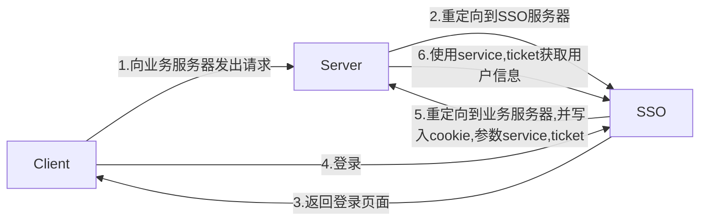

单点登录

[^1]: Central Authentication Service


# 功能设计
改功能主要参考一下两个协议：

1. `CAS 3.0.2` [^1]主要实现的是网站内部的登录信息交互。
2. `OAUTH 2.0` 主要实现的是网站外部第三方登录。


credentials (such as account and password)


## CAS 接口清单

| URI                 | 描述                                       |
| ------------------- | ---------------------------------------- |
| /login              | 登录和认证                                    |
| /logout             | destroy CAS session (logout)             |
| /validate           | service ticket validation                |
| /serviceValidate    | service ticket validation [CAS 2.0]      |
| /proxyValidate      | service/proxy ticket validation [CAS 2.0] |
| /proxy              | proxy ticket service [CAS 2.0]           |
| /p3/serviceValidate | service ticket validation [CAS 3.0]      |
| /p3/proxyValidate   | service/proxy ticket validation [CAS 3.0] |


## CAS 接口说明

### 浏览器登录流程描述：

1. 首先 **客户端** 向 **业务服务器** 发起请求。
2. **业务服务器** 判断
3. **业务服务器** 发现当前请求没有合法 *Cookie*，重定向到 **CAS Server**。
4. **CAS Server** 展示登录界面。
5. 要求用户登录。
6. 用户登录后，会写**CAS Server** 的 *Cookie* 到浏览器，同时产生 *ticket*，利用 302 跳转到 **业务服务器**。
7. 业务服务器利用生成的 *ticket* 发送到 **CAS Server** 进行验证，验证通过后，**业务服务器**生成自己的 *Cookie* 。


### 正常登录流程图

```sequence
Title: 正常登录跳转
participant Client as C
participant Server as S

C -> S: 未登录的情况，发起需要登录权限的请求
S --> C: 重定向到SSO服务器，并带上 service 参数
C --> SSO: 浏览器跳转到 SSO 服务登录页面
SSO --> C: 返回登录页面
C -> SSO: 进行登录（使用账号密码，或第三方登录等）
SSO --> C: 返回 ticket 参数，并将 token 值写入 cookie。 重定向到 Server 服务。
C --> S: 浏览器跳转到 Server 服务器，并带上参数 ticket。
S --> SSO: 使用 ticket 参数获取用户信息
SSO --> S: 返会用户信息，token值，并使 ticket 失效。
S --> C: 将 token 的值写入 cookie
```

```sequence
Title: 已登录跳转
participant Client as C
participant Server as S

C -> S: 未登录的情况，发起需要登录权限的请求
S --> C: 重定向到SSO服务器，并带上 service 参数
C --> SSO: 浏览器跳转到 SSO 服务登录页面
SSO --> C: 返回登录页面
C -> SSO: 进行登录（使用账号密码，或第三方登录等）
SSO --> C: 返回 ticket 参数，并将 token 值写入 cookie。 重定向到 Server 服务。
C --> S: 浏览器跳转到 Server 服务器，并带上参数 ticket。
S --> SSO: 使用 ticket 参数获取用户信息
SSO --> S: 返会用户信息，token值，并使 ticket 失效。
S --> C: 将 token 的值写入 cookie
```





客户端登录流程描述：

1. ​


注意问题：

1. **CAS Server** 的 *Cookie* 劫持，会导致用户登录信息泄露，必须使用 *HTTPS* 实现该过程。

2. *ticket*只能使用一次，校验后失效。有效期为 5 分钟。

3. Session 数据由 **CAS Server** 统一管理。**业务服务器** 仅仅使用 *cookie* 或 *token* 去获取 **CAS Server** 统一获取。

   ​

### /web/login

参数大小写敏感。

#### 参数

| 参数名     | 是否必须     | 类型      | 说明                                      |
| ------- | -------- | ------- | --------------------------------------- |
| service | REQUIRED | String  | CAS 客户端服务名                              |
| renew   | REQUIRED | Boolean | 是否重新验证用户名密码，true为验证用户名密码，false为只验证token |
| client  | REQUIRED | Int     | 1 为 android， 2为 iOS， 3 为 Web， 4为 H5     |


#### 授权参数

| 参数名         | 是否必须     | 类型     | 说明                            |
| ----------- | -------- | ------ | ----------------------------- |
| account     | REQUIRED | String | 手机号或邮箱                        |
| password    | REQUIRED | String | 密码，6到64位，密码只能由数字和大小写字母及下划线"_" |
| area_code   | REQUIRED | String | 手机区号，如果为“-1”，则是邮箱             |
| remember_me | OPTIONAL | Int    | 0：不过期1：两小时，2：一天，3：一个月，4：一年    |


### /client/login


1. `service` [REQUIRED]: the identifier of the application

   url encoded

2. `renew`  [REQUIRED]：

3. `gateway`

4. `ticket`


## API接口

### 获取用户信息

1. 账号密码登录
   - [ ] 国内手机
   - [ ] 境外手机
   - [ ] 邮箱


2. 第三方登录

  - [ ] qq 登录
  - [ ] 微博登录
  - [ ] B站登录 

3. token 获取


### 登出

1. 用户主动登出
2. 后台强制登出


### 注册

1. 手机注册
   1. 境内手机注册
   2. 境外手机注册
2. 邮箱注册
3. 第三方手机注册
4. 第三方邮箱注册


### 更新用户信息


### 获取用户信息


## 界面功能

### 用户禁用功能

### 用户权限功能


## 定时任务

### 清理长期没有使用的token


[^1]: 